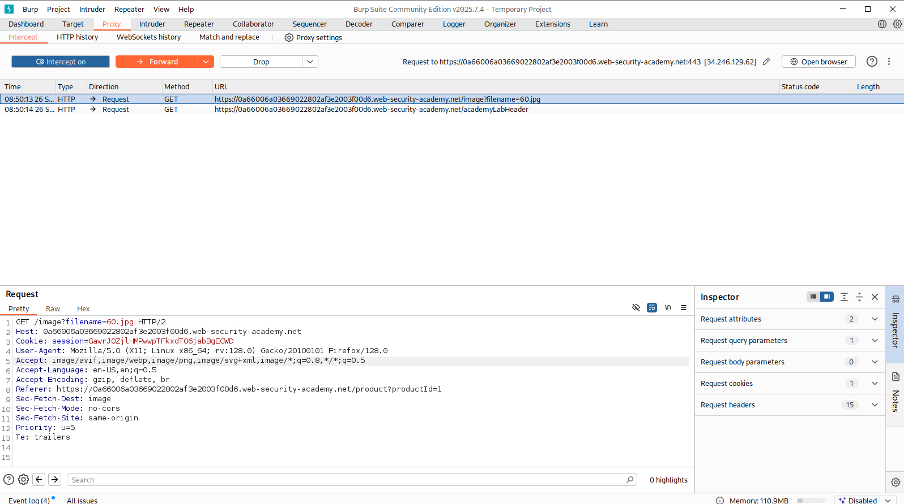
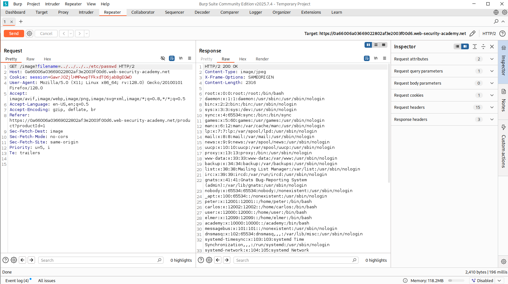

# Path Traversal (Directory Traversal)

Path Traversal (dizin gezinme / "dot-dot-slash" saldırısı), bir uygulamanın dosya yolu oluştururken kullanıcı girdisini yeterince doğrulamaması sonucu, saldırganın **web kök dizininin (web root) dışındaki** dosya ve dizinlere erişebilmesidir. OWASP bu zafiyeti **A01:2021 – Broken Access Control** kategorisi altında sınıflandırır.

Diğer adları: *directory traversal*, *directory climbing*, *backtracking*, *dot-dot-slash*.

---

## Nasıl çalışır?

Uygulamalar çoğu zaman bir dosyayı kullanıcıdan gelen parametreye göre sunar:

```
https://ornek.com/getFile?file=rapor.pdf
```

Sunucu tarafında bu istek genelde şu şekilde bir yola dönüşür:

```
/var/www/html/files/rapor.pdf
```

Eğer uygulama `file` parametresini doğrulamadan doğrudan yola eklerse, saldırgan `../` dizilerini kullanarak dizin ağacında yukarı çıkabilir:

```
https://ornek.com/getFile?file=../../../../etc/passwd
```

Bu istek sunucuda şu yola çözülür ve hassas sistem dosyası okunur:

```
/var/www/html/files/../../../../etc/passwd  →  /etc/passwd
```

Buradaki temel mantık: her `../` bir üst dizine çıkar. Yeterince `../` eklendiğinde kök dizine (`/`) ulaşılır ve oradan hedef dosyaya inilir. Windows'ta aynı işlem `..\` (ters slash) ile yapılır.

---

## Etki

Zafiyetin ciddiyeti erişilen dosyaya ve işlemin türüne (okuma/yazma) göre değişir:

- **Bilgi ifşası (okuma):** `/etc/passwd`, uygulama kaynak kodu, yapılandırma dosyaları, veritabanı bağlantı bilgileri, SSH özel anahtarları, log dosyaları.
- **Kimlik bilgisi / anahtar sızıntısı:** parola hash'leri, API anahtarları, session dosyaları.
- **Dosya yazma:** yazma işlemlerinde dosya üzerine yazma (overwrite), konfigürasyon bozma ve bazı senaryolarda uzaktan kod çalıştırmaya (RCE) zemin hazırlama.
- **RCE'ye tırmanma:** özellikle Local File Inclusion (LFI) ile birleştiğinde veya CGI gibi çalıştırılabilir dizinlere erişildiğinde koda dönüşebilir (bkz. CVE-2021-41773).

---

## Sık hedeflenen dosyalar

**Linux / Unix**

| Dosya | Neden değerli |
|---|---|
| `/etc/passwd` | Kullanıcı listesi — zafiyetin klasik PoC'u |
| `/etc/shadow` | Parola hash'leri (root gerekir) |
| `/etc/hosts` | Ağ bilgisi |
| `~/.ssh/id_rsa` | SSH özel anahtarı |
| `/proc/self/environ` | Ortam değişkenleri (LFI+RCE için) |
| Uygulama config'leri | DB parolaları, gizli anahtarlar |

**Windows**

| Dosya | Neden değerli |
|---|---|
| `C:\Windows\win.ini` | Varlık testi için tipik PoC |
| `C:\Windows\System32\drivers\etc\hosts` | Ağ bilgisi |
| `web.config` | Uygulama yapılandırması, bağlantı dizeleri |
| `C:\boot.ini` | Eski sistemlerde varlık testi |

## Lab
Bu labda amaç `/etc/passwd` dosyasını okumak. Bunun için burp uygulamasını proxy olarak açıp bir sayfaya girdim.


Giden isteklerde `/image?filename=60.jpg` ifadesi vardı.


Bu istekte bulunan filename parametresi manipüle edilip `/etc/passwd` okundu. 

