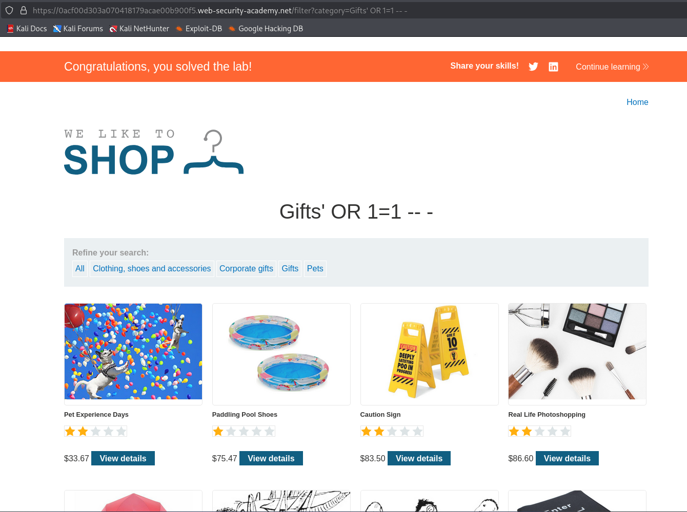
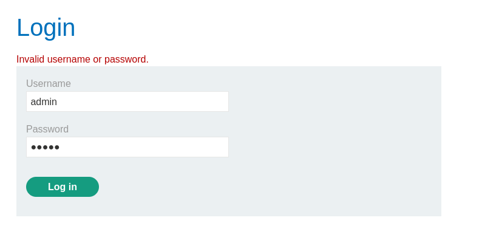
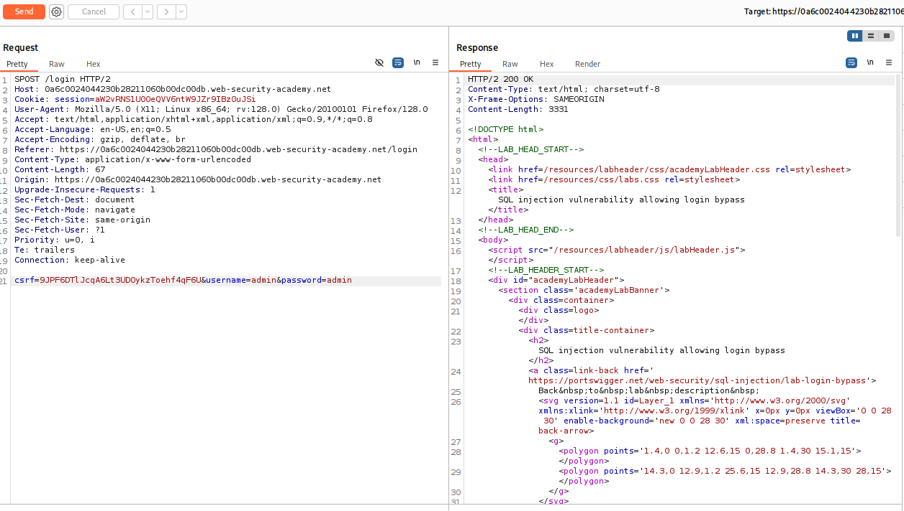
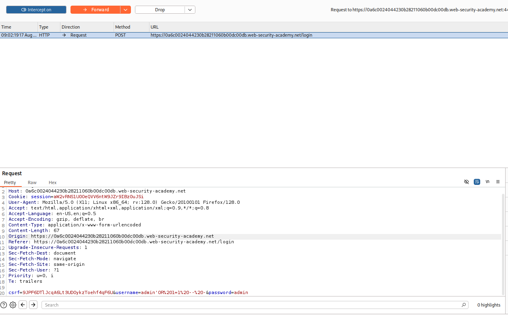
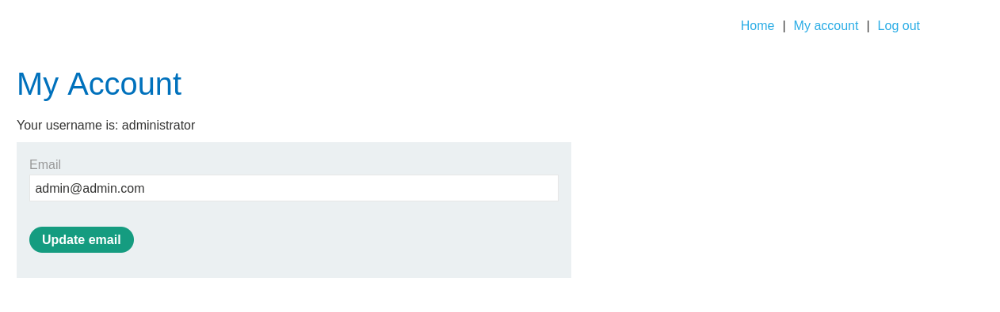
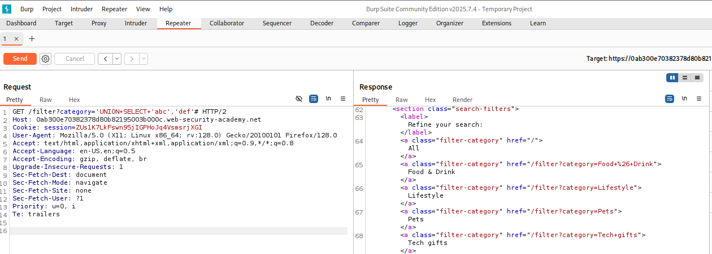
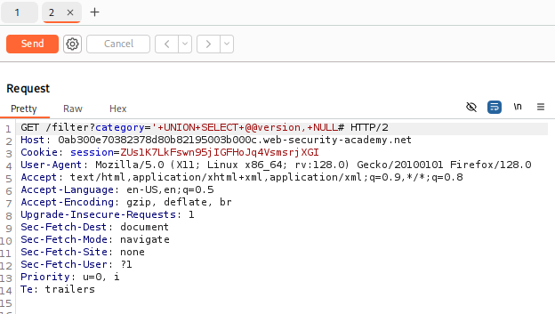
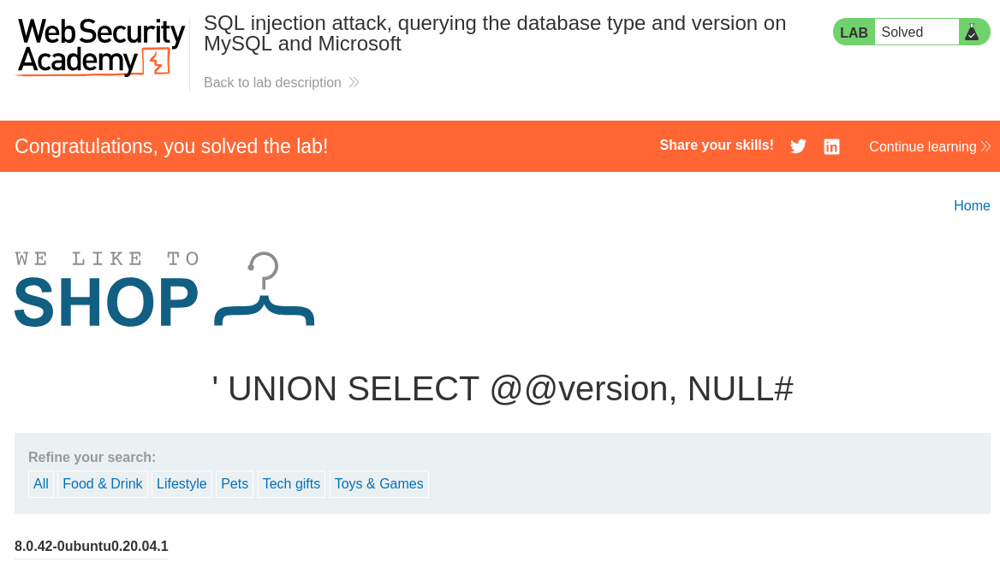

# SQL Injection Nedir?

## Web uygulaması ile veritabanı ilişkisi
Bir web uygulaması kullanıcıdan veri aldığında (login formu, arama
kutusu, URL parametresi), bu veriyi çoğu zaman bir SQL sorgusuna dahil
eder. Örneğin basit bir login kontrolü, arka planda (backend) şuna
benzer bir kod üretir:

```php
$username = $_POST['username'];
$password = $_POST['password'];

$query = "SELECT * FROM users WHERE username = '" . $username . "' AND password = '" . $password . "'";
```

Kullanıcı `admin` / `s3cr3t123` girdiğinde, oluşan sorgu:
```sql
SELECT * FROM users WHERE username = 'admin' AND password = 's3cr3t123'
```
Sorgu bir sonuç döndürürse (satır bulunursa), uygulama "giriş başarılı"
der.

## Sorun nerede?
Kod, kullanıcının girdiği metni doğrudan sorgunun içine **string
concatenation** (birleştirme, `.` operatörü) ile ekliyor. Uygulama,
kullanıcının ne yazdığını hiç sorgulamıyor — "bu bir isim mi, yoksa SQL
kodu mu" diye bir kontrol yok. Kullanıcı girdisi ile SQL kodu arasında
hiçbir sınır yok.

## Klasik saldırı: kimlik doğrulama bypass
Saldırgan, `username` alanına şunu yazarsa:
```
admin'--
```
Oluşan sorgu:
```sql
SELECT * FROM users WHERE username = 'admin'--' AND password = 'HERHANGİBİRŞEY'
```
Ne oldu?
1. Saldırganın girdiği tek tırnak (`'`), kodun kendi tek tırnağıyla
   eşleşti ve `username` string'ini erken kapattı
2. `--` sonrasındaki her şeyi (password kontrolü dahil) yorum satırına
   çevirdi, veritabanı motoru onu hiç okumadı
3. Sorgu artık fiilen şuna eşdeğer: `SELECT * FROM users WHERE username = 'admin'`
4. Parola hiç kontrol edilmeden, `admin` kullanıcısının satırı döner →
   giriş başarılı sayılır

## Daha da klasik: her zaman doğru yapmak
Saldırgan username alanına şunu yazarsa:
```
' OR '1'='1
```
Oluşan sorgu:
```sql
SELECT * FROM users WHERE username = '' OR '1'='1' AND password = '...'
```
`'1'='1'` ifadesi her zaman doğrudur (true). WHERE koşulu OR ile
birleştiği için, koşulun tamamı doğru olur — tablo tüm satırları döner.
Uygulama genelde ilk satırı (çoğu zaman admin) alıp giriş yaptırır.

## Neden bu çalışıyor — özet

| Sorun | Sonuç |
|---|---|
| Girdi doğrulanmıyor | Saldırgan istediği karakteri (tek tırnak dahil) gönderebiliyor |
| String concatenation kullanılıyor | Girdi, sorgu metninin parçası haline geliyor |
| Yorum satırı desteği var | Sorgunun geri kalanı susturulabiliyor |

## SQLi Nasıl Tespit Edilir?
1. `'` gibi karakterler ile hata ve anomali kontrolü ile
2. `OR 1=1` `OR 1=2` gibi boolean ifadeler ile
3. SQL'e özgü payloadlar ile hedef sistemin döndüreceği cevapların kontrolü ile
4. Time delay sonuçlarını doğuracak SQL payloadları kullanılarak cevapta oluşacak delay gözlemlenerek
5. Bir SQL sorgusu içinde yürütüldüğünde out-of-band bir ağ etkileşimini tetiklemek üzere tasarlanmış OAST payloadları, ortaya çıkan etkileşimleri izler

## SQLi Türleri
1. Error-Based SQLi (Blind)
2. Union-Based SQLi
3. Boolean SQLi (Blind)
4. Time-Based SQLi (Blind)
5. OOB SQLi

## Asıl çözüm: parametreli sorgu (prepared statement)
```php
$stmt = $pdo->prepare("SELECT * FROM users WHERE username = ? AND password = ?");
$stmt->execute([$username, $password]);
```
Burada kullanıcı girdisi **hiçbir zaman sorgu metni olarak
yorumlanmaz** — veritabanı motoruna "bu bir değer, kod değil" diye
baştan bildirilir. Tek tırnak göndersen bile, düz bir karakter olarak
işlenir, sorgu yapısını değiştiremez. SQL injection'a karşı asıl kalıcı
savunma budur; birazdan göreceğimiz tüm enjeksiyon türleri, bu
korumanın olmadığı yerlerde çalışır.

# Labs
## Retrieving Hidden Data

Uygulamaya giriş yapıldığında bir ürün listesi ve kategoriler ile karşılaşıldı.


Herhangi bir kategorinin içine girildiğinde `category='name'` sorgusunun çalıştığı gözlemlendi.


Sorgu `'OR 1=1 -- -` payload'ı ile manipüle edildiğinde gizli olan ürünlerin de listelendiği gözlemlendi.



## Login Bypass

Login sayfası incelendiğinde kullanıcı adı ve password girişi olduğu gözlemlendi.


`admin:admin` denemesi yapıldı ve istek incelendi.


İstek burp ile incelendi ve `OR 1=1 -- -` payload'ı ile manipüle edildi (%20 = URL encoded space character)


Manipüle edildikten sonra istek gönderildiğinde login başarılı bir şekilde bypass edildi ve administrator olarak giriş yapıldı. 


## Querying the database type and version

Category isteğine burp ile araya girildi ve sorgu `'UNION+SELECT+'abc',+'def'+#` ile manipüle edildi ve hedefe uygulamadan veri alınabilinecek sütunlar tespit edildi.


Ardından veri tabanı tipi ve versiyonunu bulmak için `'UNION+SELECT+@@version,+NULL#` payload'ı ile istek manipüle edildi ve istenilen bilgiler elde edildi.



