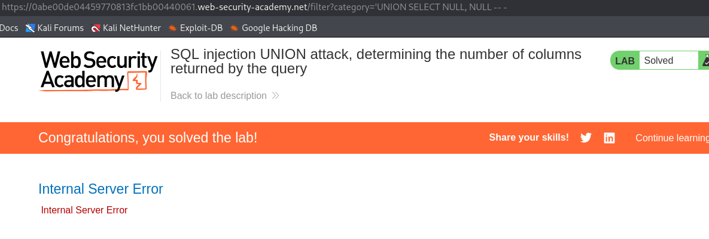
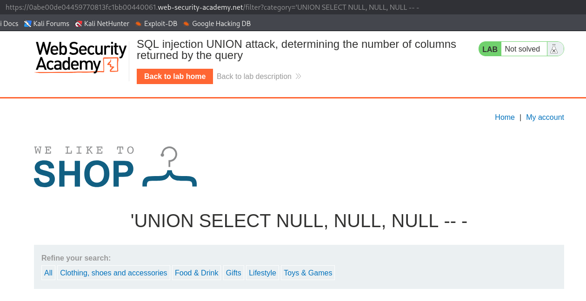
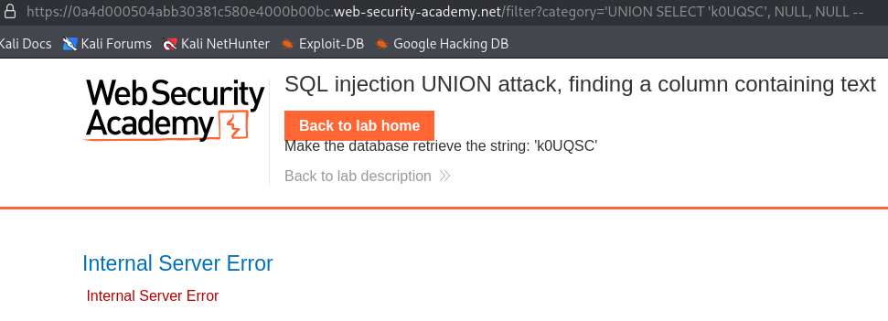
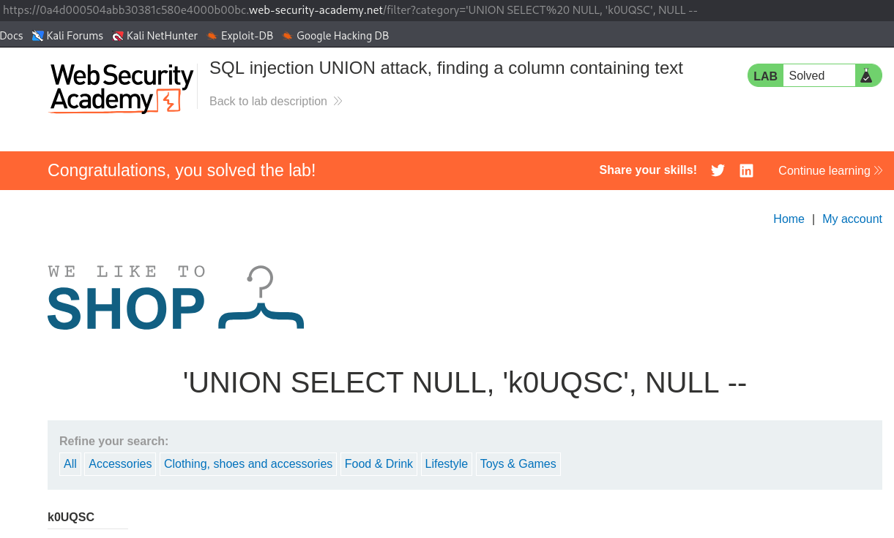
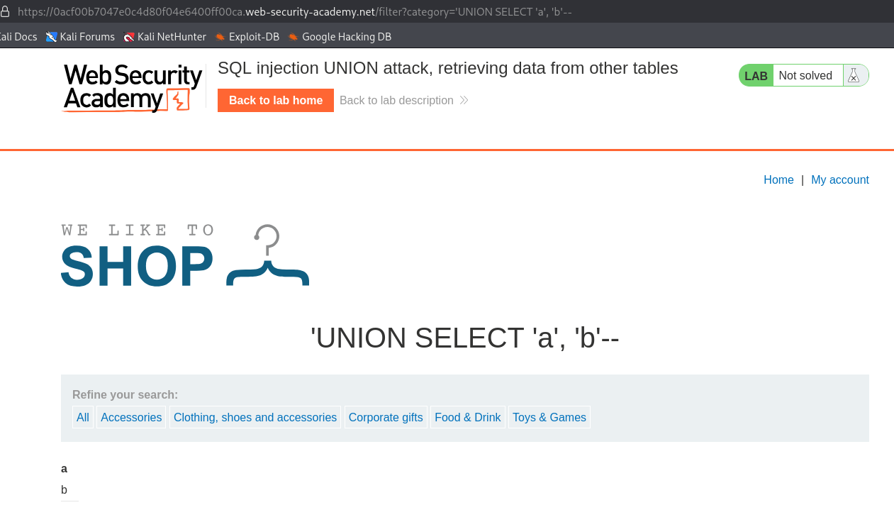
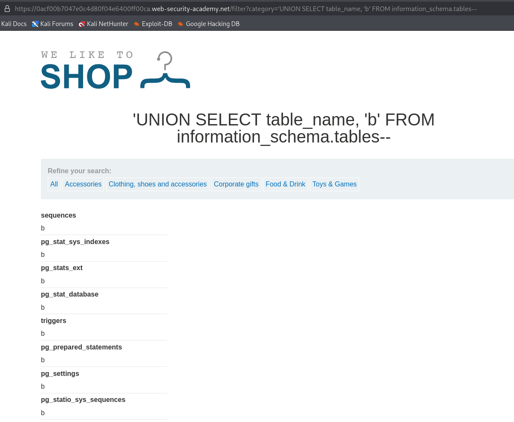
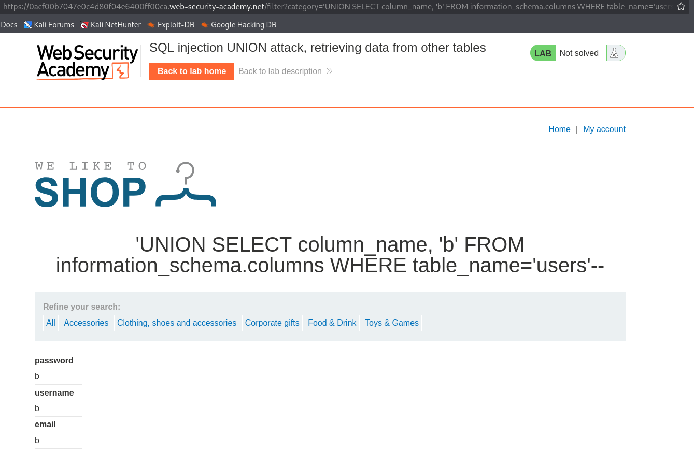
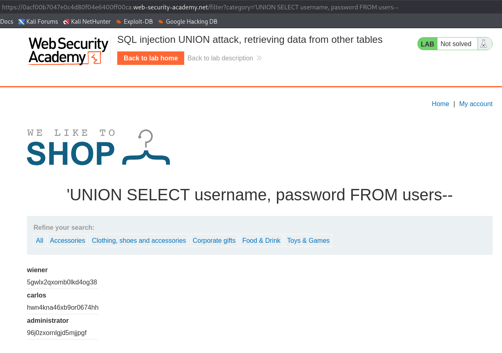
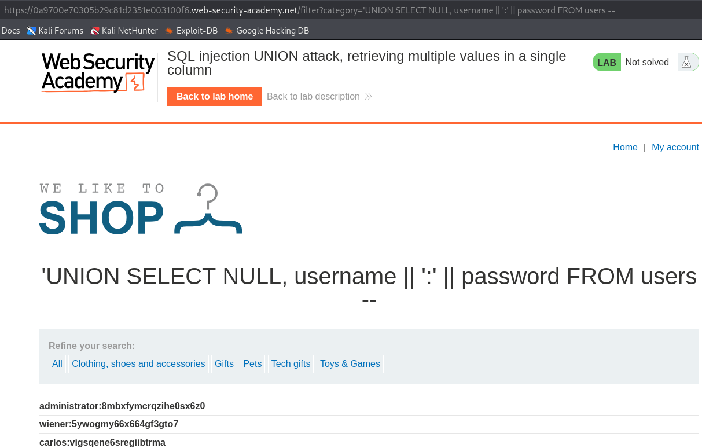

# UNION-based SQL Injection

## Mekanik
SQL dilinde `UNION` keyword'ü birden fazla `SELECT` sorgusunu çalıştırmak için kullanılır. 
Örnek:
```sql
SELECT a, b FROM table1 UNION SELECT c, d FROM table2
```
Bu sorgu ile hem table1'den a ve b sütunları hem de table2'den c ve d sütunları çekilir.

Bir UNION sorgusunun çalışması için 2 şartın sağlanması gerekmektedir. Bunlar:
1. Ayrı sorgular aynı sayıda sonuç döndürmeli. Örnekte olduğu gibi table1 ve 2 den ikişer sonuç döndü.
2. Her bir sütundaki veri türleri ayrı sorgularda uyumlu olmalıdır.

UNION based SQL injection için:
1. Orijinal sorgudan döndürülen sonuç sayısı.
2. Orijinal sorgudan döndürülen sütunlardan hangileri, enjekte edilen sorgunun sonuçlarını barındırabilecek uygun veri türüne sahip?
bilgilerinin bilinmesi gerekmektedir.

## PoC / Payload

### Sütun Sayısının Tespiti
Sütun sayısının tespitinde 2 ana metod vardır bunlardan birincisi. `ORDER BY` keyword'ü ile yapılır. Bunun için ORDER BY şartı arttırmalı şekilde hata vermeyene kadar veya farklı sonuç alınana kadar denenir. Uygulamanın hata vermediği noktada sütun sayısı belirlenmiş olunur.

```sql
' ORDER BY 1--
' ORDER BY 2--
' ORDER BY 3--
      .
      .
```

Diğer bir yol olarak da `'UNION SELECT NULL` sorgusu kullanılarak tespit edilir. Bu yolda `NULL` sayısı her denemede arttırılır ve yine diğer yolda olduğu gibi farklı bir cevap alana kadar devam ettirilir.

```sql
'UNION SELECT NULL --
'UNION SELECT NULL, NULL --
'UNION SELECT NULL, NULL, NULL --
```
ORDER BY yönteminde olduğu gibi, uygulama HTTP yanıtında aslında veritabanı hatasını döndürebilir, ancak genel bir hata mesajı verebilir ya da hiç sonuç döndürmeyebilir. Null değerlerin sayısı sütun sayısıyla eşleştiğinde, veritabanı sonuç kümesinde her sütunda null değerler içeren ek bir satır döndürür. Bunun HTTP yanıtı üzerindeki etkisi, uygulamanın koduna bağlıdır. 
Şanslıysanız, yanıtta HTML tablosundaki fazladan bir satır gibi bazı ek içerikler görebilirsiniz. Aksi takdirde, null değerler NullPointerException gibi farklı bir hataya neden olabilir. En kötü durumda, yanıt, yanlış sayıda null değerinden kaynaklanan bir yanıtla aynı görünebilir. Bu da bu yöntemi etkisiz hale getirir. 

### Kullanışlı Veri Tipi İçeren Sütunun Tespiti

Orijinal sorguda kullanılan sütun sayısının tespitinden sonra uygulama hakkında veya veri tabanında bulunan verilerin çıkartılması için kullanılabilinecek sütunun tespit edilmesi gerekir. Bunun için de bir önceki adımda kullanılan NULL parametresi yerine bir string değer yazılır ve uygulamada değişiklikler gözlemlenir
```sql
' UNION SELECT 'a',NULL,NULL,NULL--
' UNION SELECT NULL,'a',NULL,NULL--
' UNION SELECT NULL,NULL,'a',NULL--
' UNION SELECT NULL,NULL,NULL,'a'--
```
Veri tabanı ve generic bir hata mesajı görüntülenebilir o durumda bir sonraki NULL değeri yerine string ifade yazılır ve tekrar denenir.

İlgili sütunlar da tespit edildikten sonra artık veri tabanı ve tablolar hakkında bilgi toplanmabilinir.

## Lab Walktrough

### Sütun Sayısı Tespiti

Bu lab ortamında UNION SELECT NULL sorgusu ile sütun sayısı tespiti yapıldı. Sayfada bulunan kategori sorgusu `'UNION SELECT NULL -- -` ile manipüle edildi ve hata verdiği gözlemlendi.  


NULL sayısı arttırıldığında yani `'UNION SELECT NULL, NULL, NULL -- -` sorgusu yapıldığında hata vermediği ve başarılı bir şekilde sorguda 3 sütun olduğu tespit edildi.


### Kullanışlı Sütunun Tespiti

Bir önceki lab'da olduğu gibi sütun sayısı tespit edildi ardından NULL değerleri yerine string ifade yazıldı ve uygulamanın hata verdiği gözlemlendi.


Ardından bir sonraki NULL değeri ile değiştirilerek tekrar tekrar denendi ve sonunda doğru sonuca ulaşıldı.


### Bilgi Toplama

Bu uygulamada da öncelikle sütun sayısı tespit edildi ve ardından ilgili sütunlar tespit edildi. (Enumeration için birden fazla sütun da kullanılabilinir) 



Bu sütunlar kullanılarak enumeration işlemine başlandı öncelikle information_schema.tables ile tablo isimleri öğrenildi ve users tablosu tespit edildi.



Ardından users tablosuna ait sütun isimleri öğrenildi.
`'UNION SELECT column_name, 'b' FROM information_schema.columns WHERE table_name='users'--`



Son olarak kullanıcı bilgileri users tablosundan elde edildi.



Admin olarak giriş yapıldığından lab tamamlandı.

### Aynı Sütunda Birden Çok Veri Almak

Diğer lab'larda olduğu gibi öncelikle sütun sayısı ve string ifadesi döndüren sütun tespit edildi. Ardından veri döndüren sütundan kullanıcı adı ve şifre bilgilerini elde etmek için `'UNION SELECT NULL, username || ':' || password FROM users --` payload'ı kullanıldı ve admin kullanıcı bilgileri elde edildi.

