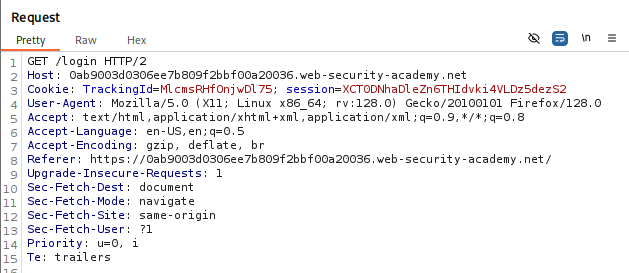
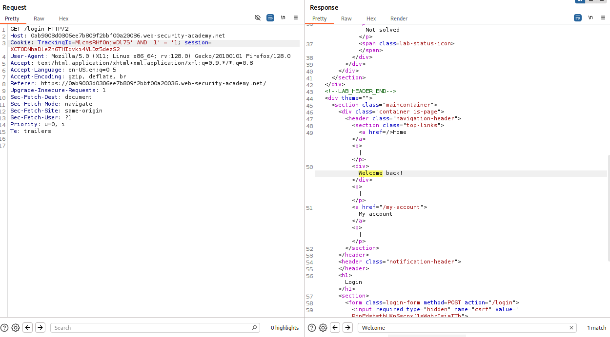
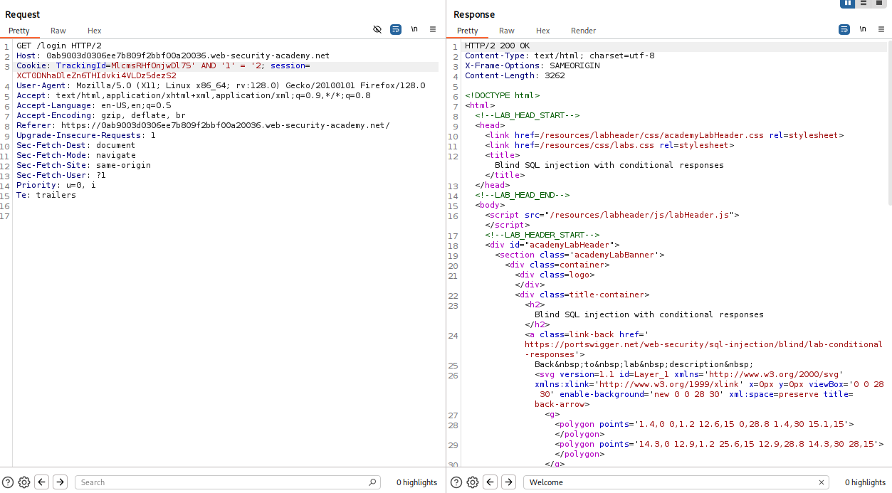
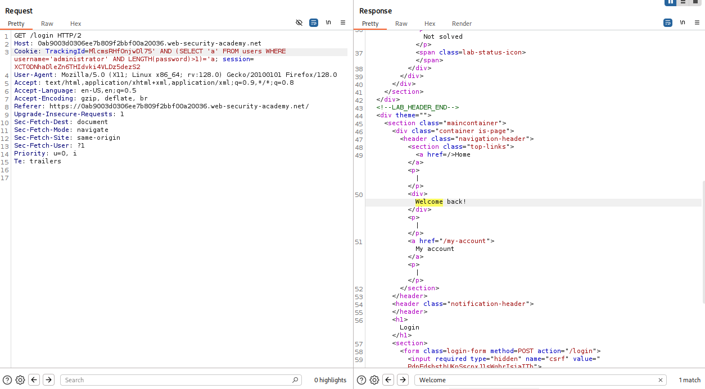
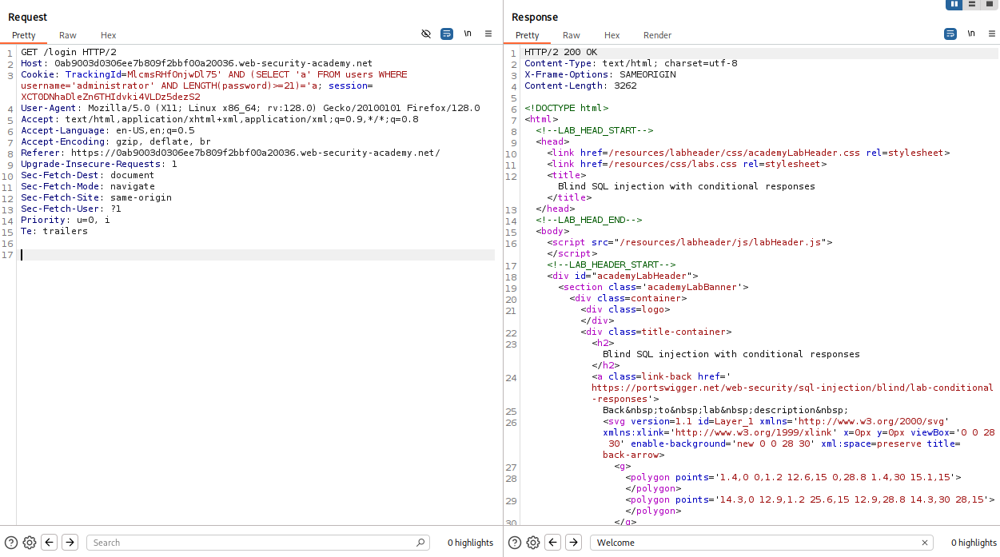
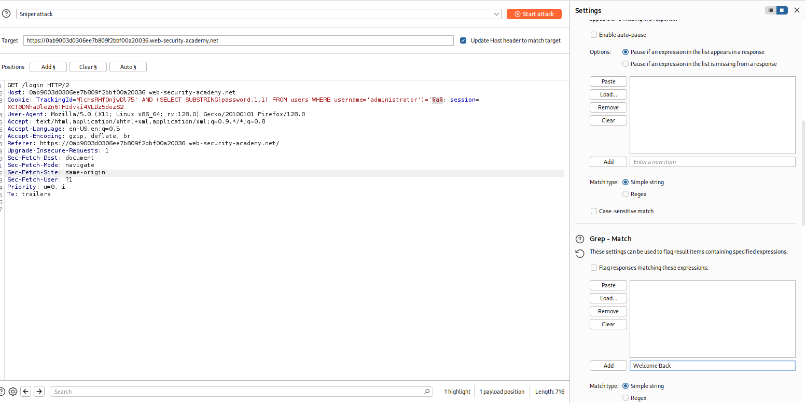
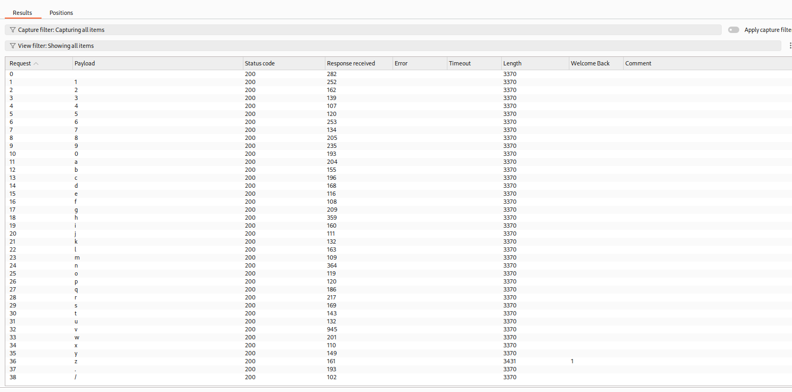
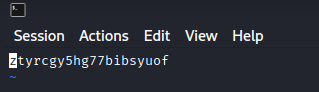

# Blind SQL Injection

Bu teknikte, sorguda belirtilen koşula göre uygulamanın cevabı gözlemlenir.

Örnek bir senaryoda, uygulama analitik amaçlı bir tracking cookie kullanır:

```
Cookie: TrackingId=xyz123
```

Bu cookie değeri arka planda aşağıdaki gibi bir sorguya dahil edilir:

```sql
SELECT TrackingId FROM TrackedUsers WHERE TrackingId = 'xyz123'
```

Sorgunun sonucu kullanıcıya doğrudan gösterilmez; ancak uygulama, sorgunun veri döndürüp döndürmediğine bağlı olarak farklı davranır. Geçerli bir TrackingId gönderildiğinde sayfada "Welcome back" mesajı görüntülenirken, geçersiz bir değerde bu mesaj görüntülenmez.

Bu davranış farkı, enjekte edilen bir koşulun doğru mu yanlış mı olduğunu belirlemek için kullanılabilir. Aşağıdaki iki değer sırasıyla gönderildiğinde:

```sql
xyz' AND '1'='1
xyz' AND '1'='2
```

İlk değerde enjekte edilen `'1'='1'` koşulu her zaman doğru olduğundan sorgu değişmeden çalışır ve "Welcome back" mesajı görüntülenir. İkinci değerde `'1'='2'` koşulu her zaman yanlış olduğundan, AND operatörü nedeniyle sorgunun tamamı yanlış hale gelir ve mesaj görüntülenmez.

Bu yöntemle, herhangi bir enjekte edilmiş koşulun doğruluk değeri belirlenebilir. Bu prensip, veriyi karakter karakter çıkarmak için genişletilebilir. Örneğin `Users` tablosunda `Administrator` kullanıcısının parolasının ilk karakterini belirlemek için:

```sql
xyz' AND SUBSTRING((SELECT Password FROM Users WHERE Username='Administrator'),1,1) > 'm
```

Bu koşul doğruysa "Welcome back" mesajı görüntülenir ve ilk karakterin alfabetik olarak `m`'den büyük olduğu anlaşılır. Koşul yanlışsa mesaj görüntülenmez. Bu karşılaştırma ikili arama (binary search) mantığıyla tekrarlanarak her karakter birkaç istekte belirlenebilir; parolanın tamamı bu şekilde karakter karakter elde edilir.

Bu süreç manuel olarak son derece zaman alıcıdır. Bu nedenle zafiyet doğrulandıktan sonra pratikte genellikle sqlmap gibi otomasyon araçları kullanılır.

## Lab

## Blind SQL Injection With Conditional Responses

Bu lab'da amaç administrator kullanıcısı ile giriş yapmak. Veri tabında users tablosu ve bu tabloda username ve password sütünlarının olduğu bilgisi önceden verilmiş. 
İlk olarak burp ile araya girilip `Cookie: TrackingId:` bilgisi elde edildi.


TrackingId sonuna `' AND '1' = '1` ve `' AND '1' = '2` payloadları (True/False) eklenip HTTP response'unda bir fark var mı diye kontrol yapıldığında True sonuçlarda 'Welcome Back' mesajı döndüğü tespit edildi.



Sonrasında `AND (SELECT 'a' FROM users WHERE username='administrator' AND LENGTH(password)>1)='a` payload'ının en sonunda bulunan >1 kısmı arttırılarak password uzunluğu tespit edildi.
Bir önceki adımda TRUE sonucunu veren sorguların Welcome Back mesajını döndürdüğünü bulmuştuk bu sebeple password uzunluğu belirtilen sayıdan küçük olana kadar yazılan bütün değerler TRUE sonucunu verecektir. FALSE sonucunu veren (Welcome Back döndürmeyen) değer şifrenin uzunluğunu belirtecektir.
Bu yöntemle şifrenin uzunluğu 20 karakter olduğu tespit edildi.



Şifrenin tespiti için ise `AND (SELECT SUBSTRING(password,1,1) FROM users WHERE username='administrator')='a` sorgusu kullanıldı. Bu sorguda username'i administrator olan kullanıcının password'ünün ilk karakterinin (password,1,1) değeri a ise TRUE değil ise FALSE sonucu dönecek.
Bu işlemi her karakter ve değer (a-z, 0-9) için manuel olarak yapmak zaman alacağı için Burp'ün Intruder modülünü kullandım.
Ayırıcı değer Welcome Back olduğu için Grep-Match alanında Welcome Back değerini tanımladım ve sorgunun solunda bulunanan "a" ifadesini işaretledim ki o değer yerine diğer değerler otomatik olarak denensin.
Welcome Back flag'i tik olan cevap o karakterin hangi değere sahip olduğunu gösterdi. Örneğin ilk karakter için "z" değerinde tik geldi.



Bu işlem her 20 karakter için tekrarlandı (password,2,1), (password,3,1) ... ve şifre elde edildi.

