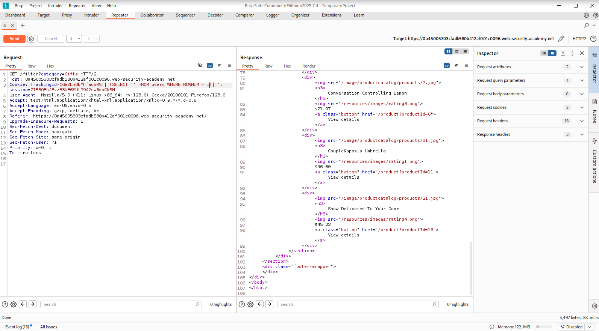
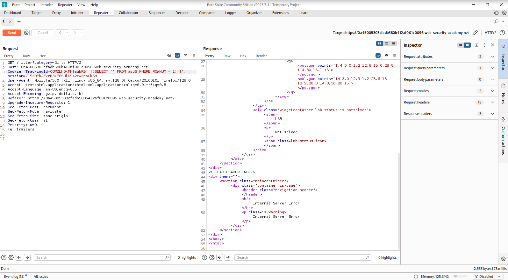
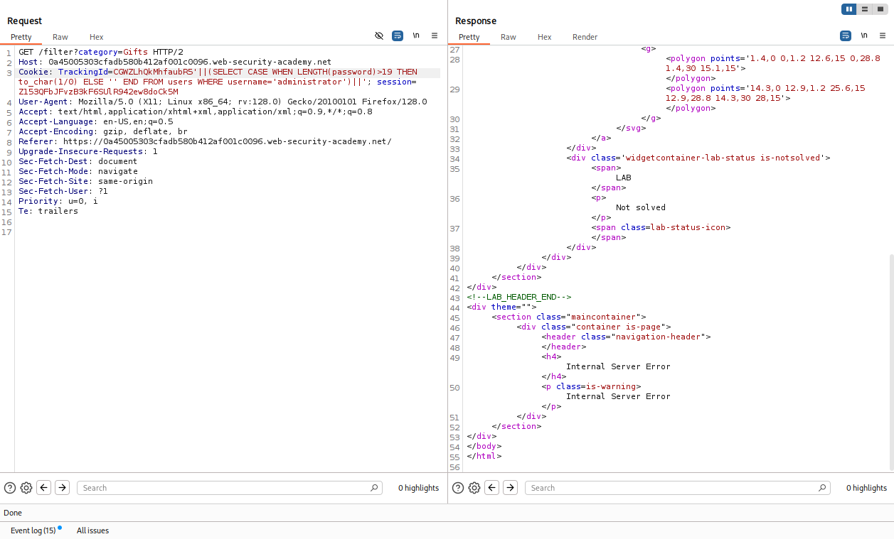
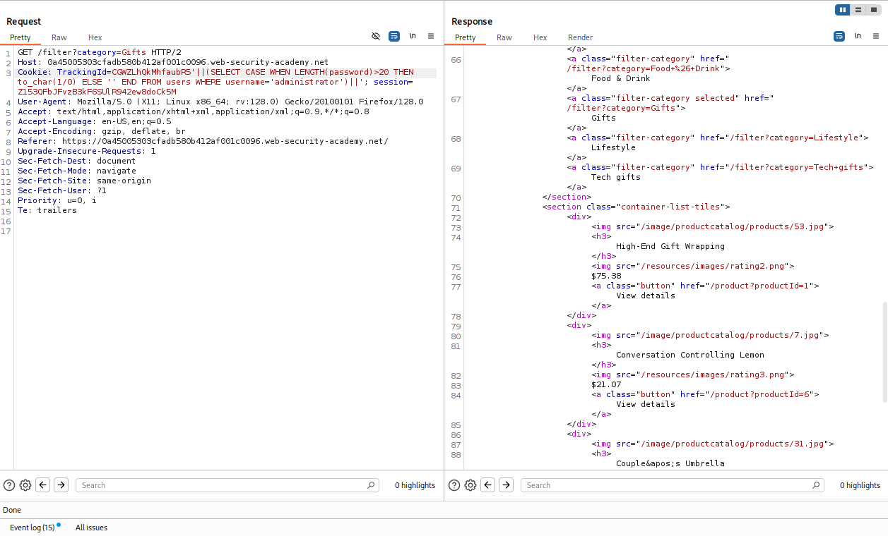
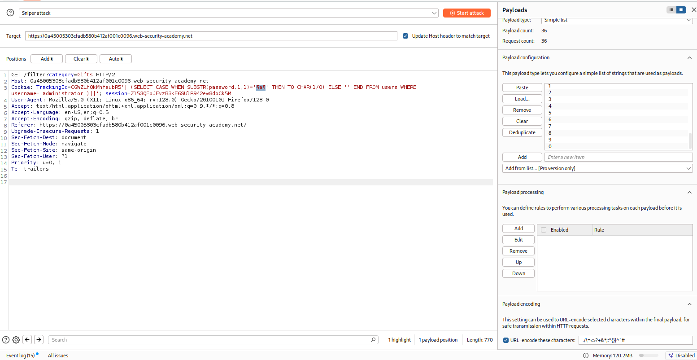
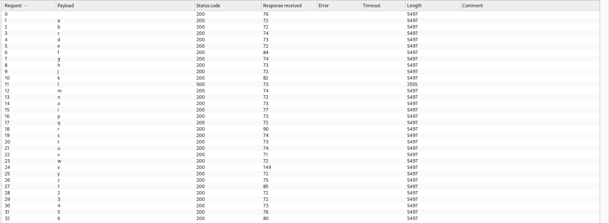
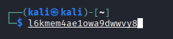

# Error-based SQL Injection

## Exploiting Blind SQL Injection by Triggering Conditional Errors

Bazı uygulamaların SQL sorguları manipüle edilse bile uygulama aynı şekilde davranır — davranışta hiçbir fark oluşmaz. Bu durumda, önceki bölümde kullanılan koşullu yanıt (conditional response) tekniği işe yaramaz, çünkü farklı boolean koşulları enjekte etmek uygulamanın yanıtında hiçbir değişiklik yaratmaz.

Bu durumda, uygulamayı bir SQL hatası oluşup oluşmadığına göre farklı bir yanıt döndürmeye zorlamak çoğu zaman mümkündür. Sorgu, yalnızca koşul doğru olduğunda bir veritabanı hatası üretecek şekilde değiştirilir. Veritabanı tarafından fırlatılan bu yakalanmamış hata, genellikle uygulamanın yanıtında bir farklılığa (örneğin bir hata mesajı) yol açar. Bu da enjekte edilen koşulun doğruluğunu çıkarsamayı sağlar.

Bunun nasıl işlediğini görmek için, sırasıyla gönderilen şu iki TrackingId cookie değerini ele alalım:

```sql
xyz' AND (SELECT CASE WHEN (1=2) THEN 1/0 ELSE 'a' END)='a
xyz' AND (SELECT CASE WHEN (1=1) THEN 1/0 ELSE 'a' END)='a
```
Bu girdiler, bir koşulu test etmek ve koşulun doğruluğuna göre farklı bir ifade döndürmek için CASE anahtar kelimesini kullanır:

İlk girdide CASE ifadesi 'a' değerine karşılık gelir, herhangi bir hataya yol açmaz.
İkinci girdide ise 1/0 ifadesine karşılık gelir, bu da sıfıra bölme hatası oluşturur.

Hata, uygulamanın HTTP yanıtında bir farklılığa yol açıyorsa, enjekte edilen koşulun doğru olup olmadığını bu farktan belirlemek mümkündür.

Bu teknik, karakter karakter veri çıkarmak için de kullanılabilir:

```sql
xyz' AND (SELECT CASE WHEN (Username = 'Administrator' AND SUBSTRING(Password, 1, 1) > 'm') THEN 1/0 ELSE 'a' END FROM Users)='a
```

## Verbose (Visible) Error-based SQL Injection

Bazı veritabanı yanlış yapılandırmaları, ayrıntılı (verbose) hata mesajları üretir. Bu mesajlar, saldırgan için doğrudan kullanılabilir bilgi içerebilir. Örneğin bir `id` parametresine tek tırnak enjekte edildiğinde şu şekilde bir hata dönebilir:,

```
Unterminated string literal started at position 52 in SQL SELECT * FROM tracking WHERE id = '''. Expected char
```

Bu hata, uygulamanın oluşturduğu tam sorguyu ifşa eder — enjeksiyonun tek tırnaklı bir string içine yapıldığı görülür, bu da geçerli bir payload kurgulamayı kolaylaştırır.

Bazı durumlarda hata mesajı, sorgunun döndürdüğü verinin kendisini de içerebilir. Bu, aksi halde blind olan bir zafiyeti görünür hale getirir. Bunun için `CAST()` fonksiyonu kullanılır — bir veri tipini başka bir tipe dönüştürmeye zorlar:

```sql
CAST((SELECT example_column FROM example_table) AS int)
```

Çekilmek istenen veri genellikle bir string'dir. Bunu uyumsuz bir tipe (`int`) dönüştürmeye çalışmak, genelde şuna benzer bir hataya yol açar:

```
ERROR: invalid input syntax for type integer: "Example data"
```

Hata mesajının içinde, dönüştürülmeye çalışılan **gerçek veri** görünür hâlde durur. Bu teknik, karakter sınırı boolean-based testleri engellediğinde de işe yarar — tek istekte bütün değeri çekebilme avantajı sağlar.

###PoC:
```sql
' AND 1=CAST((SELECT username FROM users LIMIT 1) AS int)--
' AND 1=CAST((SELECT password FROM users WHERE username='administrator') AS int)--
```

**Not:** MySQL'de aynı amaç `extractvalue()`/`updatexml()` ile, MSSQL'de `CONVERT()` ile de sağlanabilir — mantık aynı (geçersiz bir dönüşüm/ifade zorla, veriyi hata metnine düşür), sözdizimi veritabanı motoruna göre değişir.

## Lab

### Blind SQLi With Conditional Errors

"users" tablosunun ve sütunlarının bilgisi önceden varilmişti bu bilgiye dayanarak öncelikle "Cookie TrackingId=..." header'ında SQL sorgusu çalıştırılarak users tablosunun varlığı doğrulandı. Sorguda tablo adını var olmayan bir tablo ile değiştirince sayfa hata döndürdü.   



Ardından amacımız "administrator" kullanıcısının şifre bilgisini bulmak olduğu için şifrenin uzunluğu bulundu.



Son olarak da burp'ün sniper attack modülü kullanılarak Blind SQL Injection With Conditional Responses labında olduğu gibi bir yöntemle status code 500 dönen durumun kontrolü ile şifre elde edildi.




### Visible Error-Based SQLi
